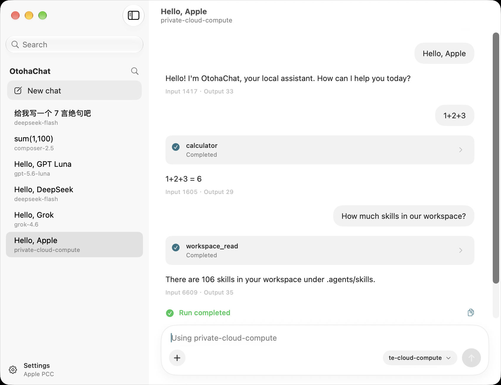

# OtohaChat

[English](README.md) | [简体中文](README.zh-CN.md) | [日本語](README.ja.md)

OtohaChat は、**[Otoha AI Player](https://otoha.co)** が利用している Swift 製 AI Harness、**[SwiftAgent](https://github.com/OtohaCo/SwiftAgent)** のネイティブ SwiftUI デモです。チャット画面は、そのランタイムの使い方そのものです。Agent、Session、Run、ストリーミング、ホストツール、永続 Journal、各社モデルのアダプターを示します。

同じアプリは、現行の iOS / macOS に付属する Apple **Foundation Models** も動かします。対応デバイスでは、別途クラウドモデルの API キーは不要です。オンデバイスモデルと、端末・地域・Apple アカウントが許す場合の **Private Cloud Compute（PCC）** です。

<p>
  <a href="https://testflight.apple.com/join/BCDWj1h1">
    
  </a>
</p>

公開 TestFlight（iOS と macOS）：[https://testflight.apple.com/join/BCDWj1h1](https://testflight.apple.com/join/BCDWj1h1)



macOS 版 OtohaChat。実行環境は Apple PCC（`private-cloud-compute`）。通常のチャット、`calculator`、認可済みワークスペースに対する `workspace_read` が、同一 Session で進みます。

## Harness が担うこと

[Otoha AI Player](https://otoha.co) は再生アプリです。行単位の解説、追加の質問、関連する AI 処理は SwiftAgent を通ります。OtohaChat は同じランタイムを ChatGPT に近い窓に置き、Host 契約を見える形にしています。

| Host の関心事 | OtohaChat での見え方 |
| --- | --- |
| ランタイム | SwiftAgent の `Agent` → `Session` → `Run` → 終端 → drain |
| ストリーミング | `AgentRun.events` から助手テキストと展開可能なツールカード |
| ツール | ホスト側の `calculator`、`datetime`、`workspace_read`、`app_notes_read`、`app_notes` |
| Skill | 認可済み `.agents/skills` のタスク文脈。`allowed-tools` に書けるのはホストツールだけ。`scripts/` は `UNSUPPORTED_RUNTIME` で実行しない |
| 永続化 | Journal と表示用トランスクリプト。API キーは Keychain のみ |
| モデル切替 | 次のメッセージから。プロバイダー私有の continuation と reasoning は前のモデルに残る |

スクリーンショットは PCC であり、クラウドベンダーではありません。サイドバーは、同じ Host に別アダプター（DeepSeek、OpenAI 互換ゲートウェイ、Grok など）を繋いだ結果です。

## iOS / macOS の Foundation Models

| 実行環境 | 内容 | このアプリでの場所 |
| --- | --- | --- |
| オンデバイス | 端末上の Apple Foundation Models | 設定 → Apple on-device。API キー不要 |
| Private Cloud Compute | PCC 上の Apple Foundation Models | 設定 → Apple PCC。プローブが Available のとき既定。TestFlight / PCC スキームは entitlement を要求する。アカウント・端末・地域の許可は Apple 側 |

SwiftAgent 1.0.0-rc.3 の PCC は実験的です。モデル切替に PCC が出ることと、完全なコアツールループの live qualification を記録済みであることは同じではありません。署名済み事例をここに残すまで、本リポジトリはそのループを `BLOCKED_CONFIGURATION` とします。

任意のクラウド（設定、Keychain のみ）：OpenAI Responses、Anthropic、DeepSeek、ローカル Responses、互換 `/responses` ゲートウェイ。

## ビルド済みデモ

1. 必要なら [TestFlight](https://apps.apple.com/app/testflight/id899247664) を入れます。
2. ベータを受け取る Apple ID で、iPhone、iPad、または Mac から [https://testflight.apple.com/join/BCDWj1h1](https://testflight.apple.com/join/BCDWj1h1) を開きます。
3. Apple モデルは、オンデバイスまたは PCC を実際に提供する端末が必要です。クラウド各社は設定に API キーを入れます。

表示名：`OtohaChat`。Bundle ID：`co.otoha.OtohaChat`。

## ソースからビルドする

1. このリポジトリを clone します。Tingting、隣の `SwiftAgent` ディレクトリ、ProviderQualification には依存しません。
2. Xcode 16 以降で `OtohaChat.xcodeproj` を開きます（開発環境は Xcode 27）。
3. **OtohaChat** スキーム（macOS）を Run します。このスキームは PCC entitlement を要求しません。
4. PCC が **Available** なら、最初の会話は PCC を優先します。そうでなければ設定でオンデバイスかクラウドを選びます。
5. 任意：`DemoWorkspace` を認可し、`/skill docs-qa` または `/skill note-capture` を送ります。

通常利用に dotenv も予算 JSON もありません。

| スキーム | 用途 |
| --- | --- |
| **OtohaChat** | 既定の macOS アプリ。PCC entitlement を要求しない |
| **OtohaChat-iOS** | iOS / iPadOS。共有 kit |
| **OtohaChat-PCC** | 同じアプリに `OTOHACHAT_PCC` と PCC entitlements ファイル。Apple の認可そのものは付与しない |

個人の `DEVELOPMENT_TEAM` は `Config/Local.xcconfig.example` を `Config/Local.xcconfig` にコピーします。このファイルは gitignore 済みです。証明書とプロファイルはコミットしないでください。

## SDK のピン

- パッケージ：https://github.com/OtohaCo/SwiftAgent
- ブランチ：`main`
- Revision：`5de9e4fd4e69c2da809f78e6a69951b0a2067b4c`

`Package.swift` は `branch: "main"` を追跡し、現在のリビジョンを `Package.resolved` にロックします。アプリ側は SDK をベンダーせず、SwiftAgent も改変しません。

## プロバイダー

| 種類 | API | 注記 |
| --- | --- | --- |
| Apple PCC | Foundation Models PCC | 利用可能なら既定。RC3 では実験的 |
| Apple オンデバイス | Foundation Models | 対応ハードウェアの macOS 26 / iOS 26 以降 |
| OpenAI Responses | `/responses` | HTTPS。未選択時は effort を省略 |
| Anthropic | Messages | RC3 のカタログが effort と thinking のオブジェクトを返す |
| DeepSeek Responses | `/responses` | effort は常に送信。既定は high |
| ローカル Responses | Responses 互換 | loopback HTTP 可。Chat Completions ではない |
| 互換ゲートウェイ | OpenAI Responses 方言 | SUB2API 系の `/responses` プロキシを含む |

TypeSafe / Jev の意思決定プロバイダーはチャットモデルとして出しません。

## テスト

```sh
bash Scripts/gate.sh
```

`swift test` は Keychain 分離（メモリストア）、エンドポイント、モック transport によるカタログと reasoning の対応、会話の drain、ツール、skill、ハンドオフ警告を対象にします。

PCC コアループ：`Tests/OtohaChatKitTests/PCCLiveLoopTests.swift` は、`OTOHACHAT_PCC_LIVE=1` と付与済み entitlement が無い限り `BLOCKED_CONFIGURATION` を記録します。

## ライセンス

MIT。会話コントローラーと execution report のコードは SwiftAgent Examples（MIT、ChainBow Co., Ltd.）から改変しています。`NOTICE` を参照してください。

OtohaChat は OpenAI、Anthropic、DeepSeek、xAI、Apple Intelligence の製品ブランドとは関係ありません。これらの名前は、対応 API の設定ラベルとしてのみ使います。
